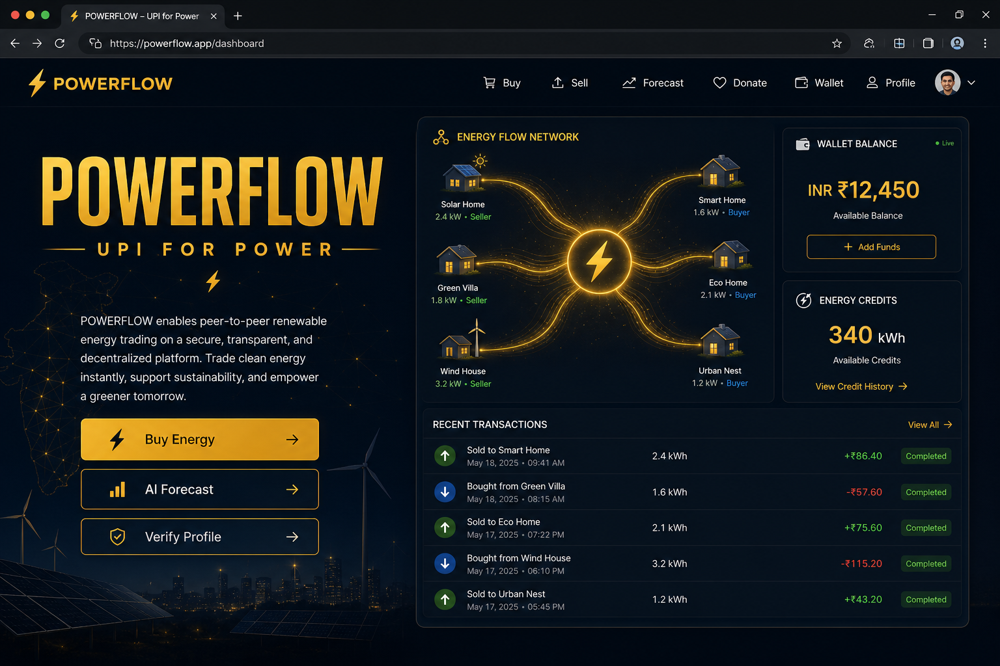
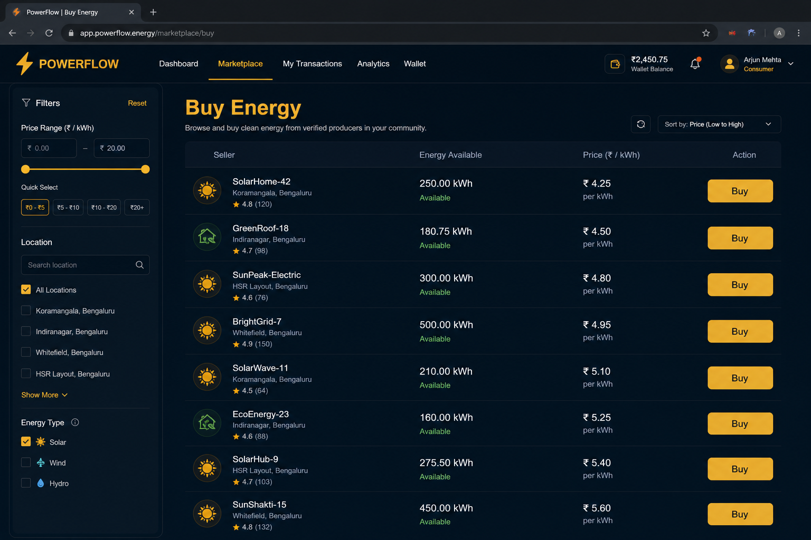
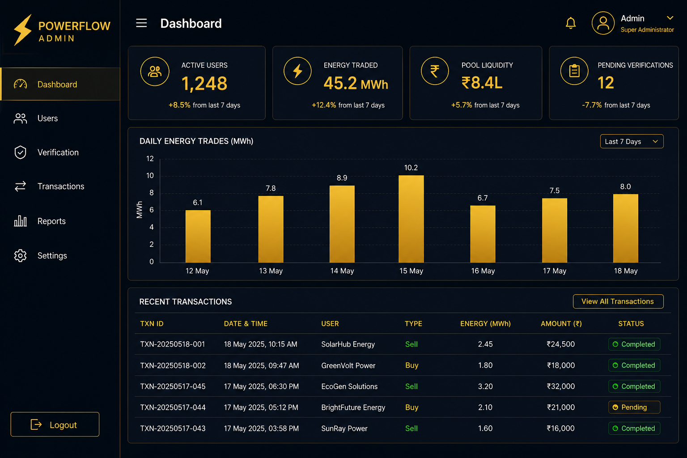

# POWERFLOW

### UPI for Power

**Peer-to-peer renewable energy trading** — connect solar producers with homes, companies, NGOs, and hospitals through a digital marketplace for electricity.

[](#tech-stack)
[](#getting-started)

---

## About

POWERFLOW is a full-stack P2P energy trading platform. Producers (rooftop solar owners and micro-generators) list surplus kilowatt-hours; buyers purchase or receive donated energy; wallets settle in INR and energy credits; and an AI service forecasts consumption and recommends trades.

Think of it as **UPI for power** — simple transfers, transparent pricing, and a live pool of available energy.

| Audience | What they do |
| --- | --- |
| **Producers** | Upload surplus energy, set price, get paid |
| **Buyers** | Browse listings, buy kWh, top up wallet |
| **Admins** | Verify users, monitor trades, tune platform config |
| **NGOs / hospitals** | Receive donated energy credits |

---

## Screenshots

### User dashboard


### Buy energy marketplace


### Admin console


---

## Features

- **Energy marketplace** — list, browse, and buy surplus renewable energy
- **Dual wallet** — INR balance + energy credits with Stripe top-ups
- **AI forecast & recommend** — Django/ML service for consumption and trade suggestions
- **Donate energy** — route credits to causes and institutions
- **KYC / profile verification** — unlock higher limits
- **Admin panel** — users, verifications, transactions, reports, platform config
- **Monorepo layout** — frontend, admin, API, and AI services in one repo

---

## Repository structure

```
Powerflow/
├── powerflow-frontend/   # User web app (React + Vite)        → :8080
├── admin-frontend/       # Admin console (React + Vite)       → :8081
├── powerflow-backend/    # REST API (Express + MongoDB)       → :4000
├── energy1/              # AI / forecast service (Django)     → :8000
└── docs/screenshots/     # README images
```

---

## Tech stack

| Layer | Tech |
| --- | --- |
| User & admin UI | React, Vite, TypeScript, Tailwind CSS |
| API | Node.js, Express, JWT, Stripe |
| Database | MongoDB (Mongoose) |
| AI / ML | Django REST, scikit-learn, XGBoost, pandas |
| Payments | Stripe |

---

## Prerequisites

Install these before running locally:

- **Node.js** 18+ and npm
- **Python** 3.11+ and pip
- **MongoDB** running locally (or a MongoDB Atlas URI)
- **Git**

Optional: a Stripe test key pair and an OpenWeatherMap API key for live weather-aware forecasts.

---

## Getting started

### 1. Clone the repo

```bash
git clone https://github.com/krishnavas23/Powerflow.git
cd Powerflow
```

### 2. Backend API (`powerflow-backend`)

```bash
cd powerflow-backend
cp .env.example .env
# Edit .env — set MONGO_URI, JWT_SECRET, ADMIN_KEY, Stripe keys if needed
npm install
npm run dev
```

API listens on **http://localhost:4000**.

### 3. AI service (`energy1`)

```bash
cd energy1
cp .env.example .env
# Edit .env — set DJANGO_SECRET_KEY (and OPENWEATHER_API_KEY if you have one)
python -m venv .venv

# Windows
.venv\Scripts\activate

# macOS / Linux
source .venv/bin/activate

pip install -r requirements.txt
python manage.py migrate
python manage.py runserver 8000
```

AI service listens on **http://127.0.0.1:8000**.

### 4. User frontend (`powerflow-frontend`)

```bash
cd powerflow-frontend
cp .env.example .env
# Defaults point at local backend (:4000) and AI (:8000)
npm install
npm run dev
```

Open **http://localhost:8080**.

### 5. Admin frontend (`admin-frontend`)

```bash
cd admin-frontend
cp .env.example .env
npm install
npm run dev
```

Open **http://localhost:8081**.

---

## Environment variables

Copy each `.env.example` to `.env`. Secrets stay local — they are gitignored.

### `powerflow-backend/.env`

| Variable | Purpose |
| --- | --- |
| `PORT` | API port (default `4000`) |
| `MONGO_URI` | MongoDB connection string |
| `JWT_SECRET` | Auth token signing secret |
| `ADMIN_KEY` | Key required for admin registration |
| `STRIPE_SECRET_KEY` / `STRIPE_WEBHOOK_SECRET` | Payments |
| `FRONTEND_URL` | CORS / redirects (default `http://localhost:8080`) |

### `powerflow-frontend/.env`

| Variable | Purpose |
| --- | --- |
| `VITE_BACKEND_BASE_URL` | API base URL |
| `VITE_AI_BASE_URL` | Django AI service URL |
| `VITE_ADMIN_URL` | Admin app URL |
| `VITE_STRIPE_PUBLISHABLE_KEY` | Stripe publishable key |

### `admin-frontend/.env`

| Variable | Purpose |
| --- | --- |
| `VITE_BACKEND_BASE_URL` | API base URL |

### `energy1/.env`

| Variable | Purpose |
| --- | --- |
| `DJANGO_SECRET_KEY` | Django secret |
| `DEBUG` / `ALLOWED_HOSTS` | Dev settings |
| `OPENWEATHER_API_KEY` | Optional weather data |

---

## Quick start checklist

1. Start **MongoDB**
2. Start **backend** on `:4000`
3. Start **energy1** on `:8000`
4. Start **user frontend** on `:8080`
5. Start **admin frontend** on `:8081` (optional)

```text
MongoDB  →  Backend :4000  →  Frontend :8080
                ↑
           energy1 :8000
                ↑
           Admin :8081
```

---

## Typical user flows

1. **Register / log in** on the user app  
2. **Verify profile** (KYC) for higher limits  
3. **Add funds** to the INR wallet (Stripe)  
4. **Buy energy** from marketplace listings — or **upload** surplus as a producer  
5. Check **AI forecast** for consumption / recommendations  
6. **Donate** energy credits to supported causes  

Admins use the admin console to verify accounts, review transactions, and adjust platform settings.

---

## Scripts reference

| Package | Dev | Production |
| --- | --- | --- |
| `powerflow-backend` | `npm run dev` | `npm start` |
| `powerflow-frontend` | `npm run dev` | `npm run build` → `npm start` |
| `admin-frontend` | `npm run dev` | `npm run build` → `npm start` |
| `energy1` | `python manage.py runserver 8000` | Use a WSGI/ASGI server (e.g. gunicorn) |

---

## Contributing

Issues and pull requests are welcome. For substantial changes, open an issue first so we can align on scope.

1. Fork the repo  
2. Create a feature branch (`git checkout -b feature/your-idea`)  
3. Commit and push  
4. Open a pull request  

---

<p align="center">
  <strong>POWERFLOW</strong> · UPI for Power<br/>
  Built for peer-to-peer renewable energy trading
</p>

